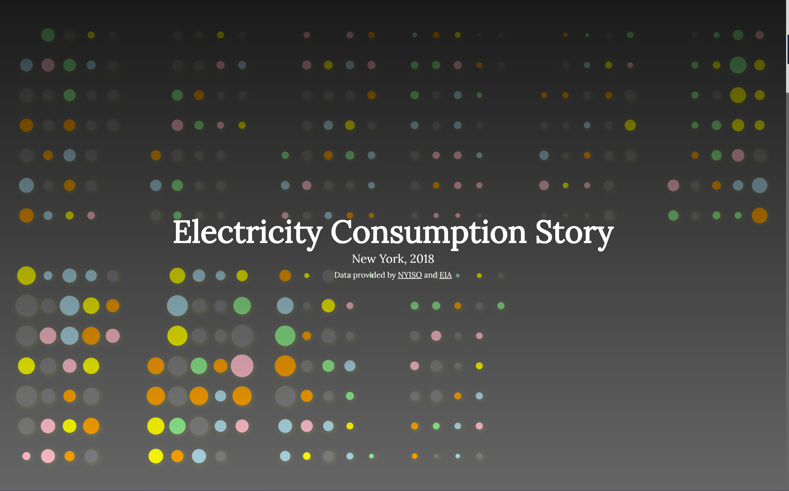
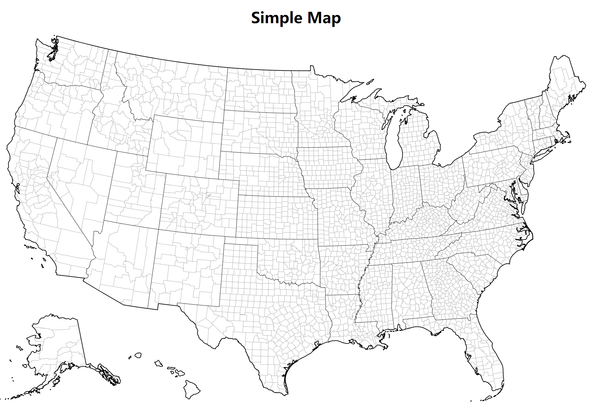
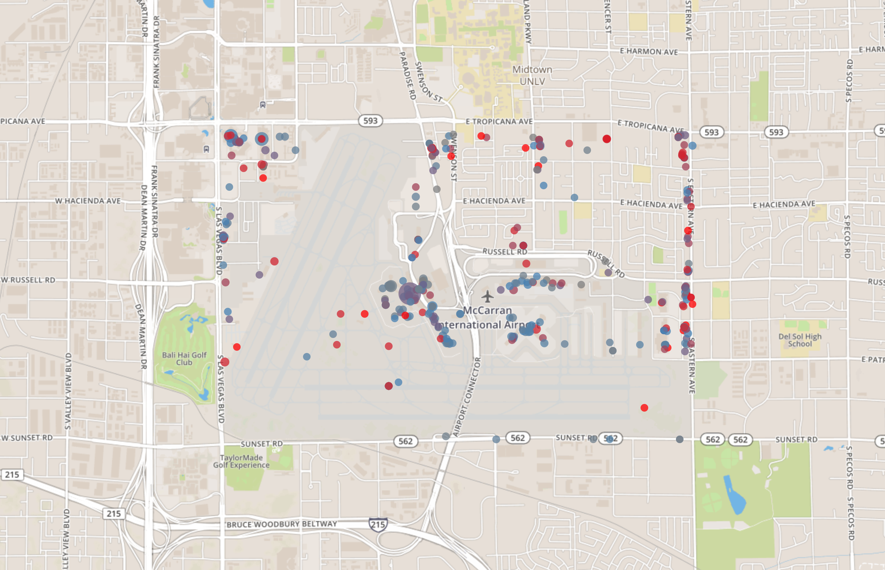
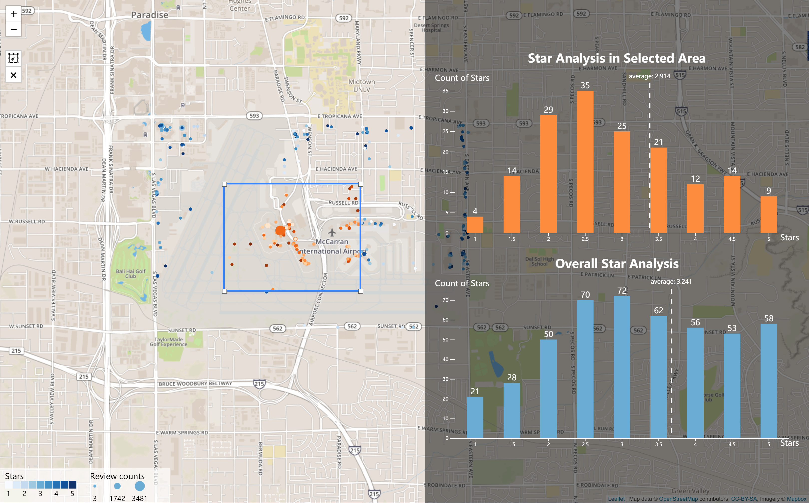
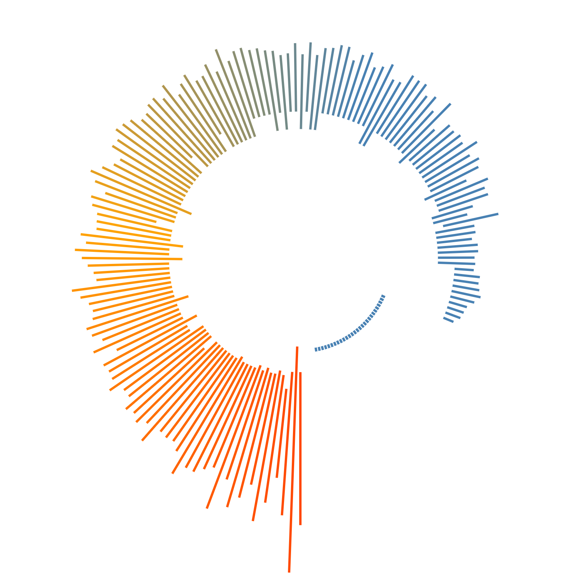

# Visualization works with D3JS
> For display, interaction, and analysis of the projects, please visit [Alan's Site](https://alan-zhufengxu.com "Alan's Site") or my [Observable homepage](https://beta.observablehq.com/@alandelip "Observable Notebook for d3").

### Electricity Consumption Story in New York

### Bar Chart
- simple bar chart
- horizontal bar chart
- stacked bar chart
- bar chart with label and interaction (TODO)
- bar chart with average line
- bar chart with customized reference line
- bar chart with timeline (TODO)
- side-by-side barchart (TODO)

### Line Chart
- simple line chart (TODO)

### Pie Chart
- simple pie chart (TODO)

### Scatter Plot
- simple scatter plot (TODO)

### Map
- simple map

- zoomable map
- map with customized dots
- map within certain ranges

- map with selected area analysis

### Music Viz
