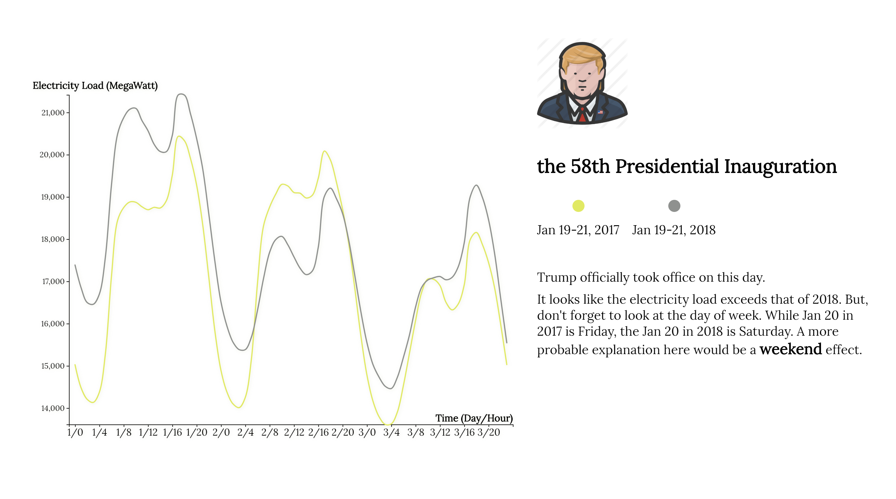

# Electricity Consumption Story in New York
<b>Human vs. Nature, Which is Driving our Electricity Use and How?</b>

Data provided by NYISO, EIA, Google Calendars and OpenWeatherMap.

**[Project Website](https://project.alan-zhufengxu.com/new-york-electricity-story)**

## Inspiration

## Relation Exploration

## Typical Days Exploration

## Issues
The full interactive project is now only available for PC.
For Mobile and Tablet, static plots are provided.

Due to the reason that the original design doesn't go well with narrow screens, full features are not 
compatible with mobiles and tablets. The purpose is to give every user a satisfied visualization experience.